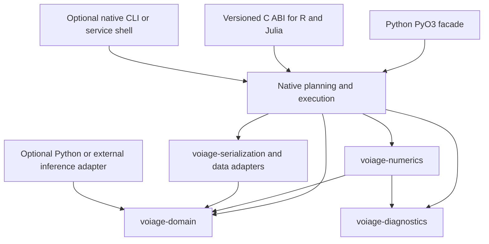

# Integrated VOI, software and public-health roadmap

Date: 2026-09-06. Status: proposed planning baseline.

This roadmap translates the repository and literature comparison into ordered
work packages. It does not schedule implementation, establish scientific
acceptance, or authorize release. No Conductor tracks or GitHub issues are
created for this roadmap. The identifiers below are document-local references.
Existing delivery work remains governed by the root roadmap and task list.

## Integrated scope and planning authority

This is the detailed planning source for all 20 proposed packages: V01–V12
(methods and assurance) and F01–F08 (software, dependencies and integrations).
The software-frontier document is now a navigation pointer to this document.
The Python and Rust dependency receipts remain dated supporting artifacts. Package identifiers
are local planning references, not Conductor track or GitHub issue identifiers.
All implementation packages remain proposed, including packages whose planning
entry is marked complete in `todo.md`.

## Combined delivery sequence

| Stage | Packages | Required inputs | Exit evidence |
| --- | --- | --- | --- |
| A — Scope and semantic foundations | V01, V02, F01; F08 producer inventory | Current source, existing contracts, primary references | Reconciled capabilities, estimator assurance protocol, dimensional/weight/unit contracts, producer fixture plan |
| B — Core methods and execution | V03, V04, V05, F02, F05; F08 first complete workflow | Stage A contracts and exact reference cases | Validated regression/moment matching/importance sampling, non-normal study models, inference diagnostics, restart-equivalent execution |
| C — Study and economic decisions | V06, F06; F04 latest-release qualification | Stage B estimates and coherent joint evidence | Reproducible ENBS optimization and economic/evidence producer workflow; isolated compatibility results |
| D — Numerical and application expansion | V07, V08, F07; selected V10 | Exact reference solvers, Stage B assurance and applicable Stage C workflow | Accuracy/cost comparisons, realistic-data and public-health reproductions, family-specific scope evidence |
| E — Advanced research designs | V09, F03, V11; remaining V10 | Accepted objective and model contracts plus tractable comparators | Acquisition/SBI/strategic-method feasibility decisions and bounded numerical benchmarks |
| Across accepted stages | V12, F04, F08 | Each method's validated contract | Installed binding parity, measured performance, real producer interchange and reproducible reports |

Stages describe dependencies rather than mandatory serial execution. F04
qualification can start after its affected contracts are settled. V07 can start
with reference two-loop models without waiting for all economic applications.
F02's conventional inference precedes its optional SBI research extension.
V12 follows individual accepted methods rather than waiting for every package.
No stage promises a release version, delivery date or automatic promotion.

## Parallel delivery and early blocker resolution

This section governs future execution of the proposed packages. It does not
activate them or create tracks/issues. Parallel work starts with independent
investigations and proceeds to implementation only after shared contracts are
settled. Package IDs remain the ownership and handoff boundary.

### Stage A preflight: resolve costly blockers first

| Potential blocker | First investigation and responsible package | Required disposition before dependent implementation | Work that can continue independently |
| --- | --- | --- | --- |
| Conflicting maturity or overlapping scope | V01 maps runtime, registries and existing programmes | One estimand/implementation owner and explicit supported scope | Source review and isolated exact examples |
| Unclear estimand or inadequate numerical reference | V02 and the relevant V package freeze assumptions and comparator | Reviewable algorithm, error budget and reproducible reference | Other estimator families with accepted references |
| Rust dependency/MSRV conflict | F04 resolves minimal features in an isolated candidate | Compatible pinned graph, newer optional lane or documented exclusion | Rust 1.85 baseline kernels and contract work |
| Missing Rust capability | F02/F06 compare native alternatives before external engines | Native implementation plan or justified bounded adapter | Native data/diagnostics and independent methods |
| Invalid joint-data semantics | F01 defines axes, weights, units and correlation | Versioned input/result contract and negative fixtures | Performance experiments using labeled synthetic inputs |
| Producer access, data rights or missing authoritative exports | F08 inventories source/format access before promising parity | Actual usable producer fixture or explicit unsupported boundary | Synthetic fixtures; no claim of producer compatibility |
| Hardware or platform unavailable | F04/V12 establish the actual qualification matrix | Measured device/installed-consumer evidence or retained experimental label | CPU reference implementation and portable artifacts |
| Scientific decision or external acceptance pending | V01/V02 identify the accountable decision and required evidence | Recorded decision for promotion; engineering completion stays separate | Bounded implementation, reproducible review packets and other accepted work |

Treat these as the first deliverables, not discoveries deferred to release.
Record a blocker with its owner, affected downstream packages, exact evidence
needed and independent fallback work. Reassess at each integration checkpoint.
Time elapsed, a mock fixture or an agent opinion cannot close an external gate.

### Parallel lanes and synchronization points

| Lane | Primary packages | Safe work before shared contract freeze | Parallel implementation after freeze | Handoff |
| --- | --- | --- | --- | --- |
| Semantics and assurance | V01, V02, F01 | Inventory, source review, exact models, schema proposals | Shared validators and assurance fixtures | Versioned contract and reference bundle to every lane |
| Estimators | V03, V04, V05, V07 | Independent algorithm reproductions | Separate estimator/model modules against the same contracts | Numerical results and error/cost evidence to V06/V08 |
| Native platform | F04, F05 | MSRV/feature probes, allocation and restart prototypes | CPU execution, storage/buffers and bounded optional backends | Executor/buffer contract to estimator and binding lanes |
| Evidence and applications | F02, F06, F07, F08 | Producer exports, data access and synthetic scenarios | Independent inference/economic/public-health adapters | Joint evidence and complete workflow fixtures |
| Bindings and user workflows | V12, F08 | Installed-consumer inventory and interface sketches | Thin language adapters and reproducible reports per accepted method | Installed parity and source-to-report evidence |
| Frontier research | V09, V10, V11, F03 | Primary-source review and feasibility examples | Only accepted bounded experiments | Separate scientific disposition; no implicit core promotion |

Each package has one implementation owner; overlapping F08 responsibilities
are divided into explicit producer, corpus and user-interface subscopes before
assignment. Contributors use isolated branches/worktrees. A single integrator
owns changes to shared domain contracts, public schemas, lockfiles, capability
registries and binding manifests. Parallel contributors propose changes to
those shared files through that owner rather than editing them concurrently.

Freeze a small vertical contract early, then deliver one native reference
calculation through a thin binding and serialized report. This synchronization
point verifies the architecture before all estimator lanes build on it.
Contract changes are versioned and communicated with affected fixtures; dependent
lanes rebase onto the accepted contract rather than maintaining private variants.

Merge small coherent PRs in dependency order. Independent lanes may validate in
parallel with bounded machine resources and separate caches/work directories;
avoid concurrent tox runs against the same environment. Run focused checks per
slice and reuse eligible baseline evidence under repository policy; run broader
checks when shared numerical, dependency or test infrastructure changes. Hosted
required checks remain tied to each exact PR head. A blocked optional backend
must not hold an independently complete CPU/core slice hostage.

### Readiness to convert a package into execution work

Before later creating a track or issue, specify the package/subscope owner,
required upstream contract revision, write-owned files, benchmark inputs,
acceptance command, known blockers and fallback, integration order and rollback
boundary. Add the concrete reference result reviewers should expect. Define
the work-in-progress limit from available CPU/memory and review capacity, not
from the maximum number of agents that can be launched.

The first proposed activation is the parallel preflight across V01/V02/F01,
F04 and F08, followed by the shared vertical contract. This is the critical path;
new GPU engines, advanced research estimators and broad public-health catalogue
expansion are deliberately outside that initial dependency chain.

## Coverage and ownership map

| Requested capability | Primary package | Supporting packages |
| --- | --- | --- |
| Missing VOI estimators and published-method parity | V03, V04, V07 | V01, V02, V05 |
| Joint PSA, inference and uncertainty diagnostics | F01, F02 | V02, V05 |
| Study models, missing data and prediction-model studies | V05, V08 | F02, V06 |
| Sample size, allocation and research economics | V06 | V03–V05, F06 |
| NMA, survey, causal and survival evidence | F06 | F01, F02, F08 |
| Budget impact, resource allocation and economic units | F06 | F01, V06, V10 |
| Disease burden, transmission, surveillance and distributional analysis | F07 | F06, V10, F08 |
| Bayesian design, multifidelity and amortized inference | V09, F03 | F02, V07 |
| Existing frontier depth and strategic information | V10, V11 | V01, V02 |
| Latest dependencies, Array API, Arrow, free threading and scalable storage | F04 | F01, V12; dependency adoption policy below |
| Checkpointing, cancellation, deterministic retries and observability | F05 | F01, F04 |
| Actual producer adapters, datasets and research user experience | F08 | F01, F06, F07 |
| Language-specific scientific capability and installed-package delivery | V12 | V01, F04, F08 |

The common definition of completion and package-specific acceptance criteria
both apply. A dependency upgrade does not close a method package; a successful
schema round trip does not close a producer integration. Each future work item
must identify its primary package and contributing packages to avoid duplicated
implementations or parallel contracts.

## Rust-first architecture and design philosophy

This is the proposed architecture for V01–V12 and F01–F08, not a claim that
these changes are implemented. Rust owns reusable domain semantics, numerical
estimators, result diagnostics and execution state. Python remains an ergonomic
research interface and a host for specialist inference; R and Julia consume
versioned native contracts as their supported methods expand. Framework choice
must not redefine an estimand or create competing method semantics.

The current workspace already separates domain, diagnostics, numerics,
serialization, Python and C adapters. Preserve that dependency direction and
extend those crates before creating new ones. Today the numerical crate has
only internal runtime dependencies: adding a query or ML framework there would
materially change the deployment contract. Native-first does not require
rewriting mature Bayesian inference, causal estimation or epidemiological
engines in Rust before their outputs can be used.

### Dependency selection: maximize Rust throughout the stack

The maintainer's explicit preference is to maximize Rust libraries, including
transitive implementation dependencies, not only the top-level numerical core.
This policy governs all candidate tables and V/F packages in this roadmap.
A Python package listed in the frontier receipt is comparative evidence, not
an equal-priority adoption recommendation.

Apply this selection order to each capability:

1. Reuse an existing internal Rust implementation when it meets the requirement.
2. Prefer a suitable maintained Rust crate, exposed through thin language bindings.
3. Prefer a Rust-backed Python/R/Julia interface when the native API is impractical,
   documenting what still requires the host runtime.
4. Use a non-Rust engine only for a demonstrated capability or scientific-evidence
   gap, with a bounded optional adapter and explicit justification.

Evaluate scientific correctness, license, numerical maturity, platform/MSRV
support, maintenance and total dependency cost before selection. Maximize Rust
without replacing a validated algorithm with an unvalidated native substitute.
Where no adequate Rust implementation exists, record the gap and assess a native
implementation path separately from the interim external adapter.

For every dependency decision, record implementation language and transitive
native stack, the Rust alternatives considered, why any non-Rust choice is
necessary, and whether the native core remains independently usable. A Rust
wrapper around a non-Rust solver does not count as Rust-native computation.

Prefer native Arrow/Parquet and Rust Polars/DataFusion qualification for data
processing; Rayon and native execution contracts for local parallelism; and
Rust numerical/surrogate backends where their method evidence is sufficient.
Treat DuckDB, Dask/Ray, JAX/PyTorch, PyMC and external economic/public-health
engines as capability-specific comparisons or justified optional integrations.
An MSRV conflict requires a compatibility disposition or a newer optional lane,
not an automatic switch to a non-Rust dependency.

Acceptance: every proposed non-Rust runtime dependency has a recorded Rust
alternative assessment and a concrete reason it is needed. Track the size and
role of the non-Rust dependency surface, not merely the count of Rust crates.
No manifest or lockfile changes are performed by this policy update.

### Architecture principles

- **Functional numerical core, explicit execution boundary:** calculations consume
  validated inputs, declared randomness and an accuracy budget. Files, network,
  caches, scheduling and user interfaces sit outside numerical routines.
- **Typed semantics:** use validated identifiers, dimensions, probabilities,
  objectives and weight kinds. Make invalid combinations unrepresentable where
  practical; validate dynamic array shapes and cross-field constraints at runtime.
- **One contract, multiple interfaces:** native types and versioned portable
  contracts define semantics. Language facades preserve diagnostics and units;
  generated bindings/schemas supplement semantic tests rather than replacing them.
- **Composition before framework dependence:** expose narrow capabilities for
  prediction, posterior sampling, model evaluation and execution. Use static
  dispatch inside hot loops where justified and runtime dispatch at coarse
  plugin boundaries. Avoid premature generic tensor or distributed frameworks.
- **Accuracy as part of the API:** report estimates, bias/MC error diagnostics,
  convergence, budgets and stopping reasons. Backend speed cannot compensate for
  changing a decision because of undocumented precision or estimator behavior.
- **Reproducibility by construction:** identify inputs, algorithm versions, RNG
  streams and logical batches independently of thread or worker scheduling.
- **Evidence before abstraction:** add a backend or crate only for an accepted
  workload and a measurable advantage. Retain explicit exclusions where a new
  dependency increases compile time, binary size or support burden without value.

### Target dependency direction

Arrows below mean "depends on", not data flow. Execution/planning and data
adapters are proposed responsibilities; split crates only when an architecture
decision establishes the need. No new crate is created by this plan.

The core must build and execute supported native methods without Python, R,
Julia, Tokio, a query engine or an ML runtime. CPU execution is the reference
lane. Specialized callbacks remain optional; they must be batched so repeated
cross-language transitions do not dominate nested EVSI. Borrowed foreign buffers
must not outlive their owners or remain subject to concurrent mutation during
native computation. An external adapter can prepare draws for native evaluation;
its existence does not make the native core dependent on its framework.

### Native contracts and scientific execution

Extend existing domain types with explicit epistemic draw, chain, patient,
subgroup, time and strategy axes, plus distinct posterior/survey/importance/
equity weight types. Keep currency, price year, discount convention and target
population tied to the result. Use constructors and fallible conversions for
validated states; preserve errors across FFI rather than silently coercing data.

Define a proposed calculation-plan representation containing the method and
algorithm version, validated model contract, input artifact IDs, RNG algorithm,
logical batch IDs, backend/precision choice, budget and reduction order. It is
a versioned scientific execution plan, not a general programming language.
Extend existing execution modes and provenance types rather than duplicating
them. Output separates complete, budget-exhausted, cancelled and failed states;
partial estimates carry their executed sample set and cannot masquerade as final.

Native estimator capabilities should support batched predictive draws, posterior
updates, payoff evaluation and deterministic aggregation. Port conjugate models,
importance weights, moment transformations and coupled MLMC reductions when
validated reference methods exist. Keep general MCMC/SBI model fitting optional.
For differentiable design, expose a separate capability with derivative and
nonsmoothness contracts; autodiff through an argmax or fitted estimator is not
assumed valid. Compare gradients against finite differences on tractable cases.

### Data plane and FFI

Evaluate Arrow Rust arrays and Parquet for portable columnar artifacts, with
Arrow C Data/PyCapsule for same-process interchange. Use borrowed numeric slices
or matrix views for dense kernels when they avoid inappropriate columnar
conversion. Arrow and a linear-algebra layout solve different problems.
Document nullability, stride, alignment, dtype, endian and lifetime handling.
Measure allocations and host/device transfers before calling a path zero-copy.

Use PyO3/rust-numpy for Python buffer boundaries; detach computation from the
interpreter only after validating ownership and concurrency safety. C ABI uses
versioned functions, opaque handles or explicitly laid-out views, caller-visible
error codes, checked lengths and documented allocation/free ownership. Never
expose Rust `Vec`, enum layout, trait objects or unwinding as an external ABI.
Retain the current audited FFI unsafe boundary; unsafe operations must not spread
into domain and numerical crates to obtain a benchmark result.

Generate compatible C headers where useful, and validate layouts with compiled
consumers. Evaluate schema generation only where it preserves the existing
canonical JSON/Arrow contracts. Check installed consumers outside the checkout.
Free-threaded CPython needs its own wheel/ABI and stress-test qualification;
current `abi3-py312` packaging alone does not establish free-threaded support.

### Parallelism, restart and observability

Evaluate Rayon for bounded CPU work. A single execution budget coordinates Rayon,
BLAS and external framework threads to prevent nested oversubscription. Tokio,
if adopted, handles I/O and orchestration outside synchronous kernels; async
syntax does not accelerate CPU arithmetic. Prefer a synchronous local baseline
before adopting a runtime or a distributed executor.

Specify an RNG algorithm and version, seed expansion and substream mapping.
Do not rely on a default RNG's identity staying stable across dependency updates.
Use deterministic logical partitions and documented reduction trees; distinguish
same-platform bitwise replay from cross-platform numerical equivalence. Explicitly
record any backend where identical bits are not promised.

Checkpoints record immutable completed batch IDs, sufficient statistics, input
hashes and algorithm state. Use atomic local writes or appropriate conditional
object-store writes. Retry reconciliation deduplicates batches rather than
assuming a scheduler provides exactly-once execution. Cancellation occurs at
safe batch boundaries. Instrument structured spans with tracing; optionally
export telemetry without logging raw patient data or full parameter draws.

### Native accelerator research lane

Compare Burn/CubeCL/wgpu and Candle only for concrete surrogate, batched payoff
or linear-algebra workloads; they are alternative experiments, not a combined
mandatory dependency stack. Compare with the existing Rust CPU and optional
JAX/PyTorch implementations. Validate double-precision availability, reduction
error, memory limits and CPU fallback on each actual target device. Mixed
precision needs a documented error budget and decision-level agreement.

Treat WebAssembly/WASI deployment, portable SIMD/nightly compiler features,
custom GPU kernels and native autodiff as scoped experiments. A browser target
requires size, sandbox, memory and supported-method checks; a server-trained
model does not automatically become a portable browser artifact. Keep these
lanes separate from supported native wheels and the current MSRV.

### Native dependency frontier

The [crates.io receipt](rust-frontier-20260906.json) records 25 observed crates,
latest stable versions, declared Rust versions, upstream maximum versions and
newest prereleases by upload date when present. A prerelease observation may be
older than the latest stable release. Missing Rust-version metadata means
unknown compatibility. Transitive dependencies and enabled features still need
resolution; a declared MSRV is not proof of whole-workspace compatibility.

| Responsibility | Observed latest stable candidates | Proposed decision |
| --- | --- | --- |
| Python boundary | PyO3 0.29.2; rust-numpy crate `numpy` 0.29.0 | Qualify together with existing abi3 policy; separate free-threaded wheel tests |
| Columnar interchange | arrow/arrow-array/arrow-schema/parquet 59.3.0 | Evaluate compatible native adapter features; declared Rust 1.85 |
| CPU linear algebra | faer 0.24.4; ndarray 0.17.2 | Compare workload-specific borrowed layouts and factorization accuracy; select only what is needed |
| CPU parallelism | Rayon 1.12.0 | Optional bounded executor; deterministic reductions and thread budgets |
| I/O and diagnostics | Tokio 1.53.1; tracing 0.1.44 | Outside the numerical core; avoid a required async runtime |
| Reproducible RNG | rand 0.10.2; rand_chacha 0.10.0 | Explicit algorithm/version and stream compatibility; declared Rust 1.85 |
| Schemas and serialization | serde 1.0.229; schemars 1.2.2 | Preserve existing contract semantics and portable artifact versions |
| Native query engine | DataFusion 55.0.0; Rust Polars 0.55.2 | Compare with existing Python Polars/DuckDB paths; DataFusion declares Rust 1.94, Rust Polars MSRV metadata is absent |
| Native ML/GPU research | Burn 0.21.0; CubeCL 0.10.0; wgpu 30.0.1; candle-core 0.11.0 | Separate backend experiments; Burn declares Rust 1.92, wgpu 1.87, others need MSRV verification |
| Assurance and bindings | proptest 1.11.0; Criterion 0.8.2; Loom 0.7.2; cbindgen 0.29.4 | Extend current tools selectively; Criterion declares Rust 1.86 and cannot silently enter the Rust 1.85 lane |

Python PyArrow and Rust Arrow have different release numbering. Likewise Python
Polars and Rust Polars versions are not interchangeable. Compatibility must be
established through the intended interchange or native dependency graph.

Plan a Rust 2024 edition/resolver-3 migration as an isolated compatibility slice.
Rust 2024 was released with Rust 1.85, so edition modernization need not itself
raise the MSRV. New optional dependencies may require a separate newer-toolchain
lane or an explicit future MSRV decision. Pin an exact stable/beta/nightly toolchain
when qualifying each lane; do not interpret the latest compiler as a new support
floor. Reuse existing update, advisory, SBOM and provenance workflows.

### Architecture acceptance and ownership

| Existing package | Additional Rust-first acceptance evidence |
| --- | --- |
| F01 / V01 | Enforced crate dependency direction; domain invariants and one method-semantics owner |
| V02–V07 / F02 | Native reference kernels and method-specific comparison with external inference; explicit error budgets |
| F04 | Allocation/copy evidence, realistic end-to-end benchmarks, CPU/device parity, supported MSRV feature combinations |
| F05 | Thread-count replay, retry deduplication, bounded concurrency, crash/restart and cancellation tests |
| V12 / F08 | Installed Python/R/Julia/C consumer fixtures, ABI ownership/error tests and versioned schema compatibility |
| F03 / V09 | Gradient validity, acquisition regret and decision-equivalence evidence for accelerator and differentiable paths |

Use property and differential tests for numerical laws and cross-language
behavior, fuzz malformed FFI/artifact inputs, and apply Miri/sanitizers to the
relevant unsafe boundary. Use Loom only for modeled concurrency primitives it
can actually explore; it is not proof of an entire application's race freedom.
Assess feature combinations explicitly because Cargo features are additive.
Measure cold build/import, binary size, steady-state memory and end-to-end
latency, not only hot-kernel speed. Preserve the minimal native build.

Before activation, record architecture decisions for native responsibility,
buffer ownership, RNG/reduction contract, crate additions, accelerator choice,
MSRV/edition and FFI evolution. These are future documents owned by the existing
packages, not new tracks or issues created here.

Sources: [current crate registry APIs](https://crates.io/),
[Rust 2024](https://doc.rust-lang.org/edition-guide/rust-2024/index.html),
[PyO3 free threading](https://pyo3.rs/main/free-threading),
[Arrow C Data](https://arrow.apache.org/docs/format/CDataInterface.html),
[faer](https://docs.rs/faer/latest/faer/), [Rayon](https://docs.rs/rayon/latest/rayon/),
[DataFusion](https://datafusion.apache.org/user-guide/introduction.html),
[Burn backends](https://burn.dev/docs/burn/backend/index.html),
[Loom](https://docs.rs/loom/latest/loom/).

## Objectives and boundaries

Prioritize scientifically defensible EVPI, EVPPI, EVSI, and expected net benefit
of sampling (ENBS) workflows before expanding the experimental method catalogue.
Separate four kinds of work: absent estimators, incomplete implementations,
validation of existing methods, and optional extensions into adjacent fields.
A mathematical estimand, its numerical estimator, and its application workflow
must have separate capability records.

The baseline is a source inspection and bounded primary-source comparison,
not an exhaustive literature review or a fresh numerical benchmark. Existing
experimental families are not presumed absent. Existing names and passing
contract fixtures do not establish published-method equivalence.

The current implementation already includes normal-model EVSI, custom two-loop
callbacks, several compatibility estimators, nonlinear metamodel infrastructure,
finite belief-state decisions, equity and implementation information, preference
information, real options, scalar estimation-focused VOI, and decision-value
Shapley attribution. Extend or validate these surfaces before adding duplicates.

## Sequence and dependency map

| Package | Priority | Dependency | Intended outcome |
| --- | --- | --- | --- |
| V01 Capability reconciliation | P0 | None | Accurate baseline and method-specific maturity |
| V02 Estimator assurance | P0 | V01 | Shared uncertainty, bias, convergence and reference protocol |
| V03 Regression and moment-matching EVSI | P1 | V02 | Validated published-method implementations |
| V04 Importance-sampling EVSI | P1 | V02 | Likelihood-based estimator with weight diagnostics |
| V05 Study-model library | P1 | V02; co-design with V03/V04 | Validated non-normal study and posterior models |
| V06 Economic study-design optimization | P1 | V03–V05 | Integrated EVSI-to-ENBS design workflow |
| V07 Multilevel and unbiased estimation | P2 | V02 and reference two-loop models | Measured bias/cost improvements |
| V08 Realistic data and prediction models | P2 | V05/V06 | Missing-data and prediction-model study workflows |
| V09 Bayesian design and acquisition | P3 | V02; V06 for economic objectives | Model-based EIG and decision-aware acquisition |
| V10 Existing frontier depth | P2, selective | V01/V02 and family-specific review | Broader validated scope without duplicate estimands |
| V11 Strategic information solvers | P3, exploratory | V01/V02; separate scope decision | Explicit feasibility and scientific dispositions |
| V12 Binding delivery | Cross-cutting | Each accepted method contract | Honest, tested language-specific availability |

P0 establishes prerequisites; P1 is the recommended core delivery sequence;
P2 expands methods and applications; P3 is optional research scope. These are
relative priorities, not calendar or release commitments. V03–V05 may proceed
independently after their shared interfaces are agreed. V07 need not wait for
all V08 applications. V12 accompanies accepted methods rather than delaying
all binding work until the final stage.

## V01 — Reconcile capability and maturity evidence

**Baseline:** `specs/software-landscape/methods.json` contains broad historical
labels. Some EVSI entries say stable while the runtime declares compatibility
paths non-stable; population scaling and information-gain helpers exist despite
planned entries. The current binding matrix is narrower than Python's exports.

**Deliverables:** audit the landscape registry, method evidence, runtime
warnings, tests, documentation, packaged resources and binding matrix together.
Record estimand, estimator, supported model class, language, maturity, numerical
reference, restrictions and evidence date separately. Distinguish implemented
helpers from complete workflows. Preserve historical release records.

**Acceptance:** every proposed package has a verified existing-surface mapping;
conflicting current claims have an explicit disposition; generated or validated
capability documentation detects contradictory maturity and availability.
No method is promoted by correcting a label alone.

## V02 — Establish estimator assurance and deepen EVPPI validation

**Baseline:** Rust-backed EVPPI and custom regression orchestration exist, as do
GAM, GP, BART and other metamodels. The custom regression path predicts over the
full input sample, including fitting observations. Generic cross-validation is
not automatically cross-fitted conditional-value estimation.

**Deliverables:** define a shared estimator result containing the point estimate,
Monte Carlo standard error or justified alternative, bias assessment, sample
counts, replication seeds/RNG, computational budget, convergence status and
warnings. Separate posterior uncertainty, surrogate error and Monte Carlo error.
Audit existing assurance objects before extending them. Add cross-fitting or
held-out evaluation for appropriate regression estimators, with correlated
parameter groups and multiple strategies. Evaluate whether INLA or another
specialized backend adds useful capability beyond existing metamodels; an R
package's API is not itself a requirement to reproduce its dependency stack.

**Acceptance:** analytical and independent high-precision reference cases cover
nonlinear conditional means, correlation, ties, rare decision switches, weak
information and small samples. Predeclare numerical tolerances and accuracy
budgets before benchmarking. Report repeated-run bias and interval coverage;
predictive R-squared alone cannot establish VOI accuracy. Assess the expected
bounds under their valid assumptions, retaining raw estimator deviations rather
than hiding them through clipping. Existing scalar-return APIs remain compatible
through an additive detailed-result interface or reviewed versioning decision.

## V03 — Complete regression and moment-matching EVSI

**Deliverables:** implement regression on declared predictive study summaries;
implement posterior-moment matching against the published algorithm, including
its sample-size extension. Specify which parameters the study informs, joint
prior dependencies, likelihood, posterior analysis and summary statistics.
Reuse shared simulation and posterior interfaces. Define a migration path for
`regression`, `efficient` and `moment_based` compatibility behavior without
silently changing their scientific meaning.

**Acceptance:** compare with analytical normal cases, high-precision nested
simulation and version-pinned R reference calculations. Include binary data,
nonlinear benefits and more than two strategies where the algorithm supports
them. Verify zero-information and increasing-information limits with Monte Carlo
uncertainty. Quantify surrogate error and sample-size curve approximation error.
Stable status applies only to the validated model and estimator combinations.

**Sources:** [S1], [S3], [S4].

## V04 — Add importance-sampling EVSI

**Deliverables:** a dedicated likelihood-based EVSI method that reuses prior PSA
samples, computes posterior weights in log space, and estimates conditional
expected benefit. Support custom likelihoods and built-in study models; define
batching, seed behavior and stable normalization. Report effective sample size,
weight concentration, numerical underflow and unsupported observations.

**Acceptance:** reproduce matched R `voi` and nested-Monte-Carlo examples;
exercise concentrated likelihoods, correlated priors, large samples and rare
outcomes. Declare when prior-sample reuse is inadequate and return actionable
diagnostics instead of plausible unsupported precision. Measure accuracy versus
model evaluations and wall time under comparable budgets. Adaptive proposals or
resampling are later extensions requiring separate estimator validation.

**Source:** [S1].

## V05 — Expand validated study models

**Deliverables:** first add Beta-binomial one-sample and two-arm binary studies.
Then assess Poisson/count models, normal observations with unknown variance,
unbalanced allocation, clustered studies and censored survival models as
separate subpackages. Distinguish a model name or trial schema from implemented
predictive simulation and posterior inference. Retain custom callbacks.

**Acceptance:** each supported model defines data shape, prior, likelihood,
parameter dependencies, posterior update and sufficient summaries. Conjugate
cases match analytical posterior moments; other cases require independent
posterior diagnostics and reference simulation. Cover invalid data, zero or
boundary events and study-design constraints. Jointly model dependence rather
than applying independent updates to correlated parameters without justification.

**Scope control:** binary models are the first commitment proposed here. More
complex models require a cost/benefit disposition before implementation.

**Source:** [S1].

## V06 — Integrate economic study-design optimization

**Baseline:** experimental COSS/design comparisons accept estimated EVSI. The
legacy clinical sample-size optimizer explicitly uses power/QALY heuristics.

**Deliverables:** connect candidate design generation, study simulation,
posterior inference, EVSI and ENBS. Start with a reproducible finite design grid;
then assess continuous optimization. Include sample size, arm allocation, fixed
and variable research costs, eligible population, horizon and discounting.
Specify incidence/prevalence semantics and timing of beneficiaries. Extend to
recruitment delay, study duration, adoption and participant opportunity costs
only through explicit model contracts, avoiding double-counted costs.

**Acceptance:** recover known grid optima; include the no-study option and
negative ENBS; compare designs using paired replications where valid. Report
uncertainty in the selected design and sensitivity to costs, population and
timing. Selection must account for optimization bias. Demonstrate an end-to-end
binary and normal example. Preserve the distinction between cost-effective
sample size, statistical power and information gain per unit cost.

**Sources:** [S1], [S4].

## V07 — Add multilevel, quasi-Monte Carlo and unbiased estimators

**Deliverables:** stage MLMC EVPPI and EVSI separately, using coupled inner
samples and documented level corrections. Assess randomized quasi-Monte Carlo
for suitable integration dimensions and randomized unbiased estimators where
their finite-variance and expected-cost assumptions hold. Provide adaptive level
allocation, stopping diagnostics and a conventional reference estimator.

**Acceptance:** demonstrate telescoping/coupling identities on small examples;
measure bias, RMSE and total model evaluations over an accuracy ladder. Include
nonsmooth maxima, ties, correlation and poor-coupling cases. Report unsuccessful
regimes. An unbiased construction does not imply finite variance or low cost;
verify those claims separately. No universal speedup claim is a release criterion.

**Sources:** [S5], [S6], [S7].

## V08 — Support realistic data and risk-prediction workflows

Three distinct application subpackages are proposed:

1. **External-validation EVSI:** evaluate validation sample sizes through clinical
   net benefit at declared risk thresholds; reproduce the published estimators
   with population transport assumptions and unit conversions explicit.
2. **Model-development EVSI:** reproduce the bootstrap-based value of additional
   development data, including refitting and held-out utility assessment. Avoid
   training/evaluation leakage and distinguish this from validation EVSI.
3. **Missing-data EVSI:** simulate individual records and MCAR, MAR and MNAR
   mechanisms, then apply an explicitly specified analysis/imputation procedure.
   Include sensitivity to non-identifiable assumptions and model misspecification.

**Acceptance:** reproduce a source example or document an independently justified
reference substitute; recover complete-data limits; assess sample-size curves
and repeated-run uncertainty. Missingness-adjusted sample size must not be
reduced to a fixed attrition multiplier. Clinical net-benefit units must not be
silently treated as monetary net benefit. Use synthetic fixtures plus lawful,
reproducible data examples where available. Keep the missing-data source marked
as a preprint until its publication status is verified.

**Sources:** [S8], [S9], [S10].

## V09 — Deepen Bayesian experimental design and acquisition

**Baseline:** existing helpers summarize supplied log likelihood ratios, rank
supplied acquisition scores and summarize amortized predictions. They do not
constitute general probabilistic fitting or acquisition optimization.

**Deliverables:** define optional probabilistic-model adapters for EIG estimation;
compare nested and variational estimators. Then assess decision-aware knowledge
gradient, batch selection with dependence, cost-aware and multifidelity
acquisition, predictive information gain, entropy search and preference learning.
Reuse established optional backends where scientifically and operationally
justified. Amortized EVSI needs a training, calibration and out-of-distribution
validation workflow beyond averaging predictions.

**Acceptance:** analytical EIG examples, estimator uncertainty and variational
bound diagnostics; an example where entropy reduction and decision value choose
different studies; acquisition comparisons under equal cost budgets; joint batch
value rather than independent top-score selection when observations overlap.
Keep nats/bits separate from utility and money. Backend dependency, CPU fallback
and serialization contracts precede support claims.

**Sources:** [S11], [S12].

## V10 — Extend existing frontier methods selectively

**Deliverables:** audit finite belief-state decisions, real options, equity,
implementation, preference, outcome-conditional information, risk-sensitive VOI
and information-source portfolios against their existing exact contracts.
Identify where the next useful step is scientific replication, fitted estimators,
continuous states, larger action spaces or decision constraints. For
estimation-focused VOI, assess vector targets and explicit covariance
scalarizations (for example trace, determinant or directional loss), preserving
units and invariance assumptions. Decision-value Shapley attribution must remain
distinct from predictive data valuation.

**Acceptance:** each extension has a concrete user problem, an estimand delta,
small exact benchmark, scaling limit and method-specific review. Approximate
belief-state solvers must be checked against the existing finite solver before
claiming larger-scale validity. Do not reopen an entire family merely because
one extension is pending. Generic metadata or scalar penalties are insufficient
evidence for a full causal, robust, equity or implementation model.

## V11 — Scope strategic information design

**Baseline:** signed social-information calculations explicitly exclude Bayesian
persuasion, mechanism design, rational inattention and general game solving.

**Deliverables:** prepare separate feasibility dispositions for these families.
Specify sender/receiver objectives, information structures, feasible signals,
equilibrium/commitment assumptions and information costs. Start with finite
examples if accepted. Evaluate a reusable solver versus a documented exclusion.

**Acceptance:** a primary-source reference, exact small example and a clear
boundary from current signed-information evaluation. Nonnegative classical VOI
must not be imposed on strategic or costly-information settings without checking
its assumptions. No general equilibrium or persuasion support is inferred from
one finite calculation. This package remains exploratory rather than a promised
core dependency or release feature.

## V12 — Deliver bindings and documentation method by method

**Deliverables:** reuse Rust kernels where appropriate while retaining declared
Python inference orchestration. Decide explicitly whether each R, Julia and C
surface is native, bridged, experimental or unavailable. Provide stable portable
input/result fixtures before expanding language interfaces. Document estimator
assumptions, failure examples and migration from legacy helpers.

**Acceptance:** installed-package numerical comparisons on supported platforms,
round-trip and CPU-reference evidence, method-specific capability discovery and
versioned examples. An installed binding package is not evidence of all-method
parity. Existing scalar APIs and published release records remain compatible
unless a separately reviewed version change is required.

## Common completion and promotion requirements

Each implementation package must supply:

- A source-linked estimand and algorithm specification, including assumptions,
  utility/loss, units, information action and supported domain.
- A baseline comparison against existing code and relevant external software,
  with exact reference versions and licensing/provenance recorded.
- Analytical or exact finite fixtures plus independent numerical reference cases;
  tests of failure regimes as well as expected behavior.
- An accuracy/cost report with bias, uncertainty, convergence and limitations.
- Reconciled runtime, capability, documentation and binding claims.
- Repository-required verification, followed by a distinct scientific maturity
  decision. Local tests, hosted CI, scientific acceptance and release are
  separate outcomes.

Before future runtime/dependency work, follow the repository dependency-frontier
protocol. Optional inference and accelerator dependencies remain behind named
extras. No new dependency is required by this planning document.

## Source register

Sources were consulted during the 2026-09-06 comparison. Recheck versions and
publication status before implementation; package presence is not numerical
parity evidence. Strategic extensions require additional primary-source review.

| ID | Primary source | Role |
| --- | --- | --- |
| S1 | [R voi EVSI reference](https://chjackson.github.io/voi/reference/evsi.html) | Importance sampling, regression, moment matching and study models |
| S2 | [R voi EVPPI reference](https://chjackson.github.io/voi/reference/evppi.html) | Comparator estimator options |
| S3 | [Heath et al., efficient moment matching](https://arxiv.org/abs/1611.01373) | Posterior-moment EVSI algorithm |
| S4 | [Heath et al., EVSI across sample sizes](https://arxiv.org/abs/1804.09590) | Sample-size extension |
| S5 | [Hironaka et al., MLMC EVSI](https://arxiv.org/abs/1909.00549) | Multilevel EVSI |
| S6 | [Goda, unbiased EVPPI](https://arxiv.org/abs/1604.01120) | Unbiased multilevel estimators |
| S7 | [Multilevel and quasi-Monte Carlo EVPPI](https://pmc.ncbi.nlm.nih.gov/articles/PMC8777326/) | Estimator comparisons |
| S8 | [Sadatsafavi et al., validation EVSI](https://pubmed.ncbi.nlm.nih.gov/39963746/) | Prediction-model validation, 2025 |
| S9 | [Safari et al., development EVSI](https://pubmed.ncbi.nlm.nih.gov/41974569/) | Prediction-model development, 2026 |
| S10 | [Benetti et al., missing-data EVSI](https://arxiv.org/abs/2607.25775) | July 2026 preprint |
| S11 | [Pyro optimal experimental design](https://docs.pyro.ai/en/stable/contrib.oed.html) | Model-based EIG estimators |
| S12 | [BoTorch acquisition reference](https://botorch.readthedocs.io/en/stable/acquisition.html) | Knowledge gradient and multifidelity acquisition |

## Dependency and software work packages

The following dependency policy and F01–F08 specifications are integral to this
roadmap. They retain the original source links, version observations and adoption
gates, alongside the V01–V12 method specifications above.

## Adoption policy

Use three lanes: current supported runtime; latest-release qualification;
and research/prerelease experiments. The newest release is an investigation
target, not an automatic production choice. Retain the supported Python matrix
and Rust 1.85 MSRV until a measured compatibility decision changes them.

The [dated registry receipt](dependency-frontier-20260906.json) records 29 direct
PyPI observations, Python constraints, upload dates and metadata hashes. Registry
versions can differ from search-engine snapshots. These observations do not
resolve dependencies together or establish compatible wheels on every platform.
The receipt is a selected-package census, not a complete audit of all transitive
dependencies or every upstream prerelease. Re-fetch the source to refresh it;
metadata hashes identify the observed response, not retained package artifacts.

Before implementation, follow the repository's `uv lock --upgrade` and
`python scripts/dependency_frontier.py . --strict` protocol in an isolated
candidate checkout. Review its report and Conductor context pack. Test candidate
extras separately before testing supported combinations; do not force all
inference, GPU and distributed frameworks into one base environment.

For each candidate, record existing requirement and lock, latest compatible
release, latest upstream release, prerelease/nightly availability, upstream
support policy, wheel/ABI availability, numerical impact, maintenance cost and
promotion decision. A newer version may need an explicit reviewed exclusion.

## Dependency candidates and concrete purpose

Versions below were observed directly from PyPI on the receipt date. All are
comparison candidates, not new declared requirements. The Rust-first selection
order above takes precedence over this inventory; assess native alternatives
before proposing any non-Rust runtime adoption. Proposed extra names are design
suggestions and are not installable interfaces yet.

| Area | Observed candidates | Purpose and qualification gate |
| --- | --- | --- |
| Core numerics | NumPy 2.5.2; SciPy 1.18.1 | Numerical reference parity, sparse/Array API compatibility; resolve the existing SciPy `<1.17` boundary explicitly |
| Labeled and tabular data | pandas 3.0.5; xarray 2026.7.0; Polars 1.44.1; PyArrow 25.0.1 | Preserve dimensions, nullable values and Arrow semantics; assess pandas `<3` and xarray `<2025` boundaries |
| Data contracts | Pydantic 2.13.5; Narwhals 2.25.0 | Typed contracts and optional dataframe portability; prove that an extra abstraction reduces conversion and maintenance work |
| JAX inference | JAX 0.11.1; NumPyro 0.21.0 | Batched inference and differentiable simulation under proposed `inference-jax`; resolve the current JAX `<0.8` boundary and actual NumPyro compatibility |
| Bayesian inference | PyMC 6.3.1; pymc-extras 0.14.0 | Hierarchical evidence and suitable marginalization/state-space methods under proposed `inference-pymc` |
| Diagnostics | arviz-base 1.3.0; arviz-stats 1.3.2 | Preserve labeled chain/draw data, R-hat, ESS and inference warnings; distinguish these from VOI Monte Carlo error |
| Acquisition and surrogates | BoTorch 0.18.1; GPyTorch 1.15.2; PyTorch 2.14.0 | Cost-aware, batch and multifidelity acquisition under proposed `acquisition-torch`; validate objective semantics and GPU/CPU agreement |
| Likelihood-free inference | sbi 0.27.0 | Neural posterior/likelihood/ratio estimation for expensive simulators under proposed `inference-sbi`; require calibration and downstream decision checks |
| Sensitivity and causality | SALib 1.5.2; DoWhy 0.14; EconML 0.17.0 | Sensitivity screening and fitted causal evidence adapters; retain identification and dependence assumptions |
| Large local data | DuckDB 1.5.5; Zarr 3.3.0 | Queryable artifacts and chunked multidimensional arrays; benchmark against the existing Arrow/Parquet path |
| Distributed execution | Dask/distributed 2026.8.0; Ray 2.58.0 | Evaluate alternate executors behind one contract; choose by restart, determinism and cost evidence rather than supporting both automatically |
| Economic/public-health engines | Pyomo 6.10.1; Starsim 3.6.1 | Optional optimization and transmission adapters; integrate rather than duplicate general engines |
| Native packaging | maturin 1.15.0 | Installed-wheel and cross-language delivery; qualify current PyO3/Rust releases separately against ABI, MSRV and platform requirements |

Also review version-pinned R/Stan producers (`voi`, `BCEA`, `hesim`, `multinma`,
`survey`, `EpiNow2`) and the existing `lifecourse`/HEOML boundary. Their versions
were not refreshed by the Python receipt and must not be inferred from it.

## F01 — Evidence-to-decision architecture (P0)

Depends on V01/V02. Define composable contracts for a decision problem, evidence
model, predictive study, posterior update, estimator, executor and result.
Reuse existing DecisionProblem, result envelopes and ingestion-provider SDK.
Map every new interface to an existing owner before adding an abstraction.

Preserve named dimensions for posterior chain/draw, patient, subgroup, time,
location, model and strategy. Distinguish probability weights, survey weights,
importance weights and equity weights. Carry units, currency/price year,
reference population, perspective and transformation provenance. Reject semantic
mismatches rather than silently flattening dimensions or converting units.

Acceptance: a producer-to-VOI-to-report example preserves these semantics across
JSON and Arrow round trips; correlated evidence stays aligned across strategies;
metadata does not substitute for enforced invariants. Maintain additive scalar
API compatibility and lazy optional imports.

## F02 — Modern inference and assurance (P1)

Depends on F01/V02; supports V03–V08. Add real PyMC/Stan/NumPyro draw adapters with
posterior-predictive checks and chain-aware diagnostics. Evaluate exact discrete
marginalization where appropriate, hierarchical evidence and model averaging.
Predictive stacking weights and posterior model probabilities are different
objects and must not be substituted without an explicit estimand decision.

For expensive simulators, evaluate neural posterior, likelihood and ratio
estimation through sbi. Add simulation-based calibration, held-out predictive
checks and posterior/decision comparisons to tractable references. Assess
posterior SBC and derived-quantity checks as research extensions. Calibration
of marginals alone does not establish joint correctness or reliable VOI near a
decision boundary. Amortized models require training provenance, held-out utility
and out-of-distribution diagnostics.

Acceptance: inference uncertainty and numerical estimator error are reported
separately; a misspecified or unconverged model produces visible diagnostics;
SBI is compared to conventional inference on the same declared decision problem.

Sources: [PyMC](https://www.pymc.io/projects/docs/en/stable/learn/core_notebooks/posterior_predictive.html),
[ArviZ](https://python.arviz.org/projects/stats/en/latest/api/generated/arviz_stats.diagnose.html),
[sbi calibration](https://sbi.readthedocs.io/en/latest/how_to_guide/16_sbc.html),
[posterior SBC](https://arxiv.org/abs/2502.03279).

## F03 — Advanced design and optimization (P2)

Extends V06/V09. Investigate differentiable design where gradients are valid,
one-shot knowledge gradient, constrained batch acquisition, cost-aware
multifidelity and multi-objective designs. Compare numerically stable log-space
improvement acquisitions with conventional formulations where relevant. Keep
entropy, hypervolume and economic utility as distinct objectives.

Use common random numbers and coupled estimators where justified; evaluate
smooth approximations against exact finite decisions, especially near ties.
Investigate causal-prior multifidelity acquisition as a research candidate,
not an established economic VOI estimator. Reconcile this with V07 multilevel
and unbiased estimation rather than introducing a competing numerical stack.

Acceptance: benchmark decision regret, uncertainty and total evaluation cost;
include constraints, pending observations and dependent batches. Verify that
cheap fidelities actually inform the target decision and that gradient/smoothing
approximations do not alter the preferred design materially without disclosure.

Sources: [BoTorch acquisition](https://botorch.readthedocs.io/en/stable/acquisition.html),
[causal multifidelity research](https://arxiv.org/abs/2602.00788).

## F04 — Array and execution performance (P1/P2)

Use the Array API for appropriate numeric operations and Arrow C Data/PyCapsule
interfaces at tabular boundaries. Evaluate device interchange explicitly; do
not claim zero-copy for operations that cast, rechunk or move data between
host and device. Preserve Arrow/Parquet as the canonical tabular exchange.

Prioritize Rust Polars/Arrow processing and assess native query/storage
implementations first. Compare DuckDB for artifact queries and Zarr v3 sharding
for multidimensional draws only where they address a demonstrated gap. Zarr is an optional internal storage
candidate requiring an export and compatibility contract, not a replacement
for the public tabular format. Measure memory and I/O along with wall time.

Keep Rust numerics independent of inference frameworks. Evaluate current PyO3
and free-threaded CPython in a dedicated qualification lane; inspect shared
state, caches, exception boundaries and imported extensions. New interpreter
support requires real wheels and thread-safety tests. Keep nightly Rust,
experimental accelerators and Python prereleases separate from the MSRV lane.

For JAX, evaluate persistent compilation caching and batched execution with
explicit precision, compilation cost and device placement. Use trusted cache
locations and key results by code, data, environment and model configuration.

Acceptance: CPU reference agreement, deterministic reductions where promised,
copy-count/memory evidence, supported-device fallbacks and installed-artifact
benchmarks. Do not advertise a speedup based only on kernel timing that omits
compilation, transfer or inference work.

Sources: [SciPy Array API](https://docs.scipy.org/doc/scipy/dev/api-dev/array_api.html),
[Arrow interface](https://arrow.apache.org/docs/format/CDataInterface/PyCapsuleInterface.html),
[Polars lazy execution](https://docs.pola.rs/user-guide/lazy/),
[Zarr sharding](https://zarr.readthedocs.io/en/stable/user-guide/arrays/),
[PyO3 free threading](https://pyo3.rs/main/free-threading),
[JAX cache](https://docs.jax.dev/en/latest/persistent_compilation_cache.html).

## F05 — Resumable and observable research execution (P1)

Introduce a local executor contract before choosing distributed dependencies.
Support durable batches, cancellation, restart and partial-result validity.
Derive RNG streams from stable logical task identifiers; scheduling and retries
must not silently change the estimand or double-count samples. Define whether
repartitioning is bitwise reproducible or only numerically equivalent.

Record input/code/environment hashes, artifact schemas, elapsed time, model
calls, memory, convergence and stopping reason. Reuse existing decision cards
and lineage constructors, then validate actual producer formats. Bind caches to
semantic inputs and precision, not just filenames. If hosted execution is later
accepted, give authentication, authorization, quotas and isolation their own
service design rather than embedding them in the numerical kernel.

Acceptance: kill/restart a bounded job and compare with uninterrupted execution;
exercise duplicate delivery and failed workers; export a report that identifies
incomplete results. Distributed scheduling is optional and must demonstrate
benefit over local execution at a declared workload size.

## F06 — Statistical and economic integration (P1/P2)

Build actual producer fixtures for NMA/meta-regression, survey estimates,
causal effects, survival and state-transition models. Prioritize joint NMA
treatment effects/covariance, then population adjustment and individual plus
aggregate evidence. Survey design uncertainty and causal identification belong
to the evidence model; downstream VOI must not claim to validate them by itself.

Extend budget impact to incremental treatment mixes, population entry/exit,
uptake and annual cash flows. Add optimization adapters for allocating multiple
interventions across capacity, budget, facilities and time. Support economic
reference cases with versioned currency/price-year and discount conventions.
Validate existing simplified PSA and HTA helpers before broadening their claims.

Acceptance: reproduce version-pinned external output and an end-to-end reference
analysis; preserve correlation, costs, units and time; compare realistic
population/constraint scenarios with small exact cases. General simulation and
causal inference engines remain external to the VOI kernel.

Sources: [multinma](https://github.com/dmphillippo/multinma),
[hesim](https://hesim-dev.github.io/hesim/articles/intro.html),
[survey](https://r-survey.r-forge.r-project.org/survey/html/00Index.html),
[DoWhy](https://arxiv.org/abs/2011.04216),
[Pyomo](https://www.pyomo.org/documentation).

## F07 — Public-health and distributional workflows (P2)

Add burden-of-disease adapters with YLL/YLD/DALY provenance, transmission-model
coupling for spillovers, and surveillance/nowcasting adapters for uncertain
reporting delays. Evaluate economic research decisions on those outputs rather
than merely attaching epidemiological labels to generic arrays.

Extend distributional analysis with baseline lifetime health, opportunity-cost
distribution and inequality-aversion sensitivity. Assess extended CEA for
financial-risk protection and impoverishment. Keep these outcomes and value
judgments distinct from ordinary net monetary benefit. Screening, spatial
allocation and environmental exposure-response workflows are subsequent
scope-reviewed candidates, not newly supported capabilities.

Acceptance: one reproducible public-health source-to-decision example before
expanding the catalogue; compare complete/delayed reporting and direct/spillover
benefits; make population weights and welfare assumptions reviewable.

Sources: [WHO burden metrics](https://www.who.int/data/gho/data/themes/mortality-and-global-health-estimates/global-health-estimates-leading-causes-of-dalys),
[Starsim](https://docs.starsim.org/), [EpiNow2](https://epiforecasts.io/EpiNow2/),
[NICE DCEA](https://www.nice.org.uk/process/pmg36/resources/support-document-health-inequalities-15313210669/chapter/distributional-cost-effectiveness-analysis-methods),
[extended CEA application](https://www.healthsystemmodeling.com/publication/2015_verguet_public_financing/).

## F08 — Interoperability and research product design (P0/P1)

Prioritize authoritative producer exports over additional invented format names.
Validate real R/Python tool round trips, versioned MLflow/OpenLineage records and
installed consumer packages. Retain RDS and proprietary formats as unsupported
until a real parser and lawful reference fixture exist. Reuse HEOML and current
ingestion contracts rather than establishing a parallel interchange standard.

Build a small real-data corpus with source receipts, deterministic transforms,
normalized draws, expected results and report assertions. Extend the existing
CLI/decision studio with input diagnostics, method applicability, uncertainty,
scenario comparison and reproducible export. An optional service or interactive
UI must use the same calculation contract as the CLI and installed library.

Acceptance: users can reproduce a complete analysis without private files,
notebook state or developer-only dependencies; unsupported producers and
estimators fail clearly; every reported result resolves to its evidence bundle.

## Qualification and refresh

First complete V01/V02 and F01/F08, then F02/F05 alongside V03–V06. F04 upgrades
can be qualified independently when their affected interfaces are stable.
Activate F06/F07 through concrete reference workflows; F03/SBI and strategic
information research remain separately scoped experiments.

Each adoption decision requires dependency resolution, package/artifact hashes,
license and advisory review, supported-platform installation, numerical parity,
performance evidence where claimed, serialization round trips and documented
fallbacks. Retain minimum-version tests alongside latest-compatible and isolated
upper-bound/prerelease lanes. Reuse Renovate rather than creating another
version-update mechanism. Review upstream releases before minor releases and
at the existing quarterly landscape refresh; security events and material
algorithm changes trigger earlier review. This document creates no automation.

For research candidates, record primary source, publication/preprint status,
estimand assumptions, implementation source, benchmark and counterexample before
promotion. No finite review can guarantee that every newest dependency or paper
has been incorporated; a dated, repeatable frontier review is the design goal.

## Planning handoff

When implementation is later requested, reconcile each proposed package with
existing open work and historical scientific dispositions before creating any
execution records. Freeze its concrete scope, assumptions, dependency lane,
reference fixtures, acceptance criteria and exclusions. Convert only the
accepted slice into tracks/issues at that time. This consolidated roadmap
creates neither Conductor tracks nor GitHub issues and performs no dependency
upgrade, runtime implementation, scientific promotion or release.
